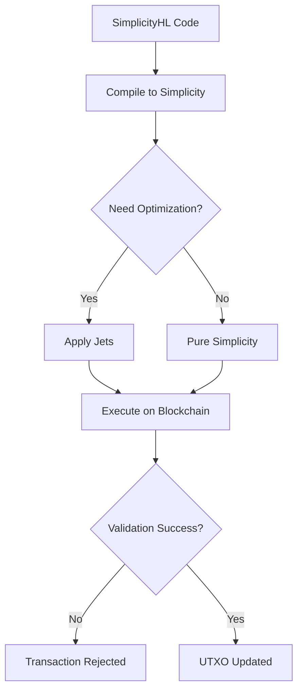

Simplicity is a typed, combinator-based, functional smart contract language without loops or recursion, designed as a more powerful and analyzable alternative to Bitcoin Script. Developers write contracts in human-readable, Rust-like SimplicityHL, which compiles into the core Simplicity representation. 

Frequently used operations are implemented as jets. Jets are predefined, highly efficient building blocks, allowing contracts to execute complex conditional payments, options, and multi-party transactions with predictable resource usage and no reliance on a central authority.

