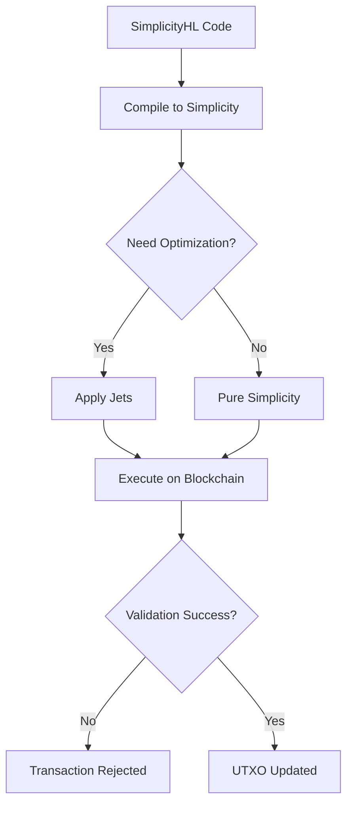

# How Simplicty works

Simplicity is a typed, combinator-based, functional smart contract language without loops or recursion, designed as a more powerful and analyzable alternative to Bitcoin Script. Developers write contracts in human-readable, Rust-like SimplicityHL, which compiles into the core Simplicity representation.

Frequently used operations are implemented as jets. Jets are predefined, highly efficient building blocks, allowing contracts to execute complex conditional payments, options, and multi-party transactions with predictable resource usage and no reliance on a central authority.

Let's delve deeper into how Simplicity works within the Bitcoin ecosystem:

## SimplicityHL Compilation and Simplicity Bytecode

SimplicityHL is a developer-friendly front-end language, engineered to simplify the process of writing smart contracts by offering a syntax akin to the Rust programming language. It effectively abstracts away the intricate, low-level functional programming details inherent in raw Simplicity. The SimplicityHL Compiler is the dedicated toolchain responsible for translating SimplicityHL code into its foundational Simplicity representation. This approach is crucial because, while Simplicity offers profound mathematical expressiveness, its low-level nature means that practically, developers will write in higher-level languages that then compile down to Simplicity, complete with formal proofs of their correct operation.

The resulting Simplicity binary format, often colloquially referred to as "bytecode," is distinctly not traditional machine code and operates fundamentally differently from byte-aligned systems. Instead, it is a canonicalised representation of the program's abstract syntax tree (AST). Simplicity itself is a low-level, typed, combinator-based functional programming language and machine model designed specifically for blockchain-based smart contracts, operating directly on bit strings rather than bytes.

This bit-oriented approach is a deliberate and crucial design choice, optimising for the unique constraints of blockchain environments. Simplicity programs are structured as Directed Acyclic Graphs (DAGs), which are topologically sorted lists of nodes representing untyped expressions with explicit sharing of subexpressions. This DAG structure is then serialised using a highly efficient binary prefix code. This bit-level packing maximises compactness, minimises bandwidth and storage requirements, and plays a vital role in preventing denial-of-service attacks and transaction malleability by ensuring precise consumption of witness data. For instance, the `inflate` function, which decodes bit strings into Simplicity values, fails unless it consumes exactly all of its bit string argument. This precision means there's no room for unused padding that could otherwise be exploited.

When this binary format is loaded into the Bit Machine, Simplicity's abstract interpreter, it meticulously reconstructs the syntax tree for evaluation. This process is more accurately described as "assembling" a Simplicity tree rather than traditional compilation, as it bypasses the complex optimisations typically associated with compilers. The Bit Machine itself operates on values represented as arrays of cells, where each cell can be a `0`, `1`, or an `undefined` value, further underscoring the system's fundamental bit-level granularity. This design ensures predictable and formally verifiable resource usage, a cornerstone of Simplicity's high-assurance smart contract capabilities.

## Contract Storage and Integration in Taproot

Simplicity contracts are designed to integrate seamlessly into Bitcoin via Taproot's tapleaf versioning system. This allows for a flexible blend of Simplicity scripts with existing Bitcoin Script or standard Taproot key-spend paths within the same transaction.

Specifically, a Simplicity program is committed to a commitment Merkle root, which is a hash of its syntax tree. This Merkle root is what gets stored on-chain, not the full script. This leverages the Merklized Abstract Syntax Trees (MASTs) principle, where programs are organised into trees, and only the necessary branches are revealed at redemption time, significantly enhancing privacy and reducing block space requirements. Just as with Bitcoin's Pay-to-Script-Hash (P2SH), where only a script's hash is committed initially and the full script is revealed when funds are redeemed, Simplicity adopts this efficient and private model.

## Broadcasting to the Mempool and Running Alongside Bitcoin Transactions

When a transaction contains a Simplicity program (or more precisely, its commitment Merkle root within a Taproot output), it is broadcast to the mempool just like any other Bitcoin transaction. The transaction's validity, including the Simplicity component, is verified by network nodes according to the consensus rules. A Simplicity program is defined as an expression with trivial input and output values (type `1->1`), and its semantics determine whether the provided witness data authorises the redemption of funds for a specific transaction input.

This design allows Simplicity to run alongside traditional Bitcoin transactions. By integrating via Taproot's tapleaf versions, a single transaction can incorporate outputs controlled by conventional Bitcoin Script, Taproot key-spends, and Simplicity scripts. This means Bitcoin continues to function as programmable money, with Simplicity extending its capabilities beyond the limitations of original Bitcoin Script, without requiring a separate blockchain. It simply augments the existing, robust infrastructure.

## Versioning for Simplicity Upgrades

The integration of Simplicity leverages Taproot's tapleaf versioning system for managing upgrades and introducing new functionalities. Taproot allows each script path in a Merkle tree to have its own version number. When a leaf within a Taproot tree is spent, if it carries a specific Simplicity version number, the network will invoke the Simplicity runtime instead of the standard Bitcoin Script runtime. This offers far greater flexibility compared to older Bitcoin scripting versions.

This versioning mechanism also supports the evolution of Simplicity's underlying components. For example, if there are significant improvements to cryptographic libraries, new versions of Simplicity jets can be substituted through this system. While introducing new jets might necessitate a soft fork, Simplicity's inherent expressiveness, combined with a comprehensive library of existing jets and combinators, aims to minimise the need for frequent soft forks by enabling a vast range of applications without requiring changes to the core language.

## Jets and Their Weight Calculation

Jets are optimised native code implementations that act as "shortcuts" for large, complex Simplicity expressions, significantly compressing their representation and execution footprint. These native implementations are formally proven to be functionally identical to the more verbose Simplicity expressions they replace. Examples of jets include common cryptographic functions like SHA-256 compression and Schnorr signature verification, as well as various arithmetic and introspection operations.

Examples of jets include:

- **Cryptographic functions**: These are crucial for secure smart contracts. Specific examples include the SHA-256 compression function and Schnorr signature verification (BIP-340). Other elliptic curve functions for `secp256k1` are also included, such as point verification, scalar arithmetic, and field element operations.

- **Arithmetic operations**: Simplicity includes jets for various arithmetic functions, such as 32-bit addition, subtraction, and multiplication. General multi-bit logic operations like complement, `and``, `or`, and `xor` are also implemented as jets

- **Introspection operations**: These allow smart contracts to examine transaction data. Examples include `script-cmr` (script commitment Merkle root), `internal-key`, `version`, `lock-time`, `output-value`, `input-value`, `tapleaf-version`, and `tappath`.

- **Time locks**: Jets exist for various time-based conditions like `check-lock-height`, `check-lock-time`, `tx-height-lock`, `tx-time-lock`, `tx-distance-lock`, and `tx-duration-lock`, which assert conditions based on block height or time.

- **Elements-specific jets**: For the Liquid Network, Simplicity includes additional jets related to Elements features such as issuances, assets, amounts, range proofs, and surjection proofs.

The weight (similar in spirit to Bitcoin’s vbytes, but tied to computational and memory usage) of a Simplicity program, including its jets, is calculated using static analysis before execution. This crucial feature enables users to determine the maximum computational resources (CPU time and memory) a program will require, even for worst-case scenarios. This pre-computation capability is a fundamental defence against denial-of-service attacks, as transactions with excessively costly scripts can be rejected early.

Simplicity employs a fine-grained cost function that allows for precisely calibrated fees based on the actual resources consumed, balancing affordability for legitimate use with disincentives for network abuse. There are two categories of jets:

1. **Ordinary jets**: Handled locally by implementations.

2. **Discounted jets**: These receive special treatment under consensus rules, with explicitly defined cost overrides that are determined through benchmarking, rather than being calculated solely by the Bit Machine's default rules.

This mechanism ensures that highly efficient native code implementations (jets) are correctly accounted for, making complex smart contracts economically viable and predictable for Bitcoin's robust, long-term infrastructure. Simplicity thus empowers builders with unprecedented security and flexibility, solidifying Bitcoin's role as a foundation for a resilient, censorship-resistant financial future.

